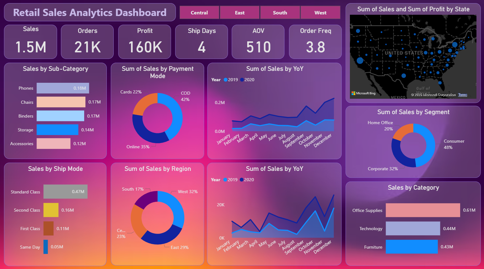

# Retail Sales Analytics Dashboard

## Project Overview
This project focuses on analyzing retail e-commerce sales data to understand business performance across sales, profit, customers, products, and shipping operations.  
The dashboard provides a consolidated view of key business metrics and trends to support data-driven decision-making.

It helps stakeholders track revenue growth, profitability, customer behavior, and operational efficiency across different regions and product categories.

---

## Objectives
- Monitor overall sales and profit performance  
- Analyze customer purchasing behavior  
- Identify high-performing and loss-making products  
- Evaluate shipping performance and order trends  
- Support strategic business and operational decisions  

---

## Dataset Description
The dataset includes transaction-level sales data with the following attributes:
- Order details (Order ID, Order Date, Ship Date)
- Customer information (Customer ID, Segment, Region)
- Product details (Category, Sub-Category, Product)
- Sales metrics (Sales, Profit, Quantity)
- Shipping details (Ship Mode, Delivery Days)
- Payment mode and regional data

---

## Key Performance Indicators (KPIs)
- Total Sales  
- Total Orders  
- Total Profit  
- Profit Margin (%)  
- Average Order Value (AOV)  
- Order Frequency  
- Average Shipping Days  

---

## Dashboard Analysis

### Sales & Profit Overview
- Overall revenue and profit performance
- Year-over-Year (YoY) sales trends
- Profitability analysis across categories and regions

### Product Performance
- Top-selling and most profitable products
- Identification of loss-making products
- Category and sub-category contribution analysis

### Customer Insights
- Order frequency and customer engagement
- Customer segmentation analysis
- Repeat vs one-time customer behavior

### Shipping & Operations
- Average delivery time analysis
- Performance comparison by shipping mode
- Impact of shipping on sales and returns

---


### Dashboard Overview


---

## Tools & Technologies
- Power BI  
- DAX  
- Data Modeling  
- Data Visualization  

---

## Sample DAX Measures

### Profit Margin %
```DAX
Profit Margin % =
DIVIDE(
    SUM(Sales[Profit]),
    SUM(Sales[Sales]),
    0
)

Prayag Dutt Upadhyay
GitHub: https://github.com/Prayag077

LinkedIn: https://www.linkedin.com/in/pd-upadhyay/